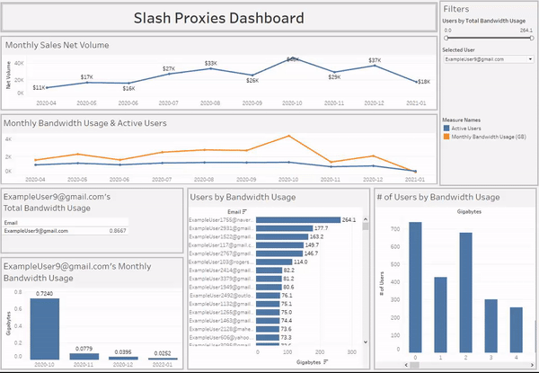

# Use Case: Provides ease of access to core statistics on global and specific customer IP-proxy bandwidth usage rates.

# Authors
- [@slashdavid](https://github.com/slashdavid)

# Table of Contents
- [Business problem](https://github.com/slashdavid/slash-proxies-dashboard#business-problem)
- [Data Collection](https://github.com/slashdavid/slash-proxies-dashboard#data-collection)
- [Tech stack](https://github.com/slashdavid/slash-proxies-dashboard#tech-stack)
- [Quick view of dashboard](https://github.com/slashdavid/slash-proxies-dashboard#quick-view-of-dashboard)
  [Cleaning the datasets](https://github.com/slashdavid/slash-proxies-dashboard#tech-stack)
- [Repository structure](https://github.com/slashdavid/slash-proxies-dashboard#repository-structure)

# Business problem
This dashboard allows me to obtain a clear perspective on company performance in relation to customer bandwidth usage patterns. When sourcing residenital proxies from upstream providers, you're limited to the information that their platform aggregates, which is often quite limited. This dashboard solves this issue by organizing and displaying this information under a user-friendly design.

# Data Collection
As this project was inspired by my company, Slash Proxies, I was 
# Tech Stack
- Python
- SQL
- Tableau

# Quick view of dashboard
[Link to Tableau Public](https://public.tableau.com/app/profile/david.zhang2464/viz/CustomerBandwidthUsageDashboard/Dashboard?publish=yes)



# Cleaning the datasets
- Received an export of all user bandwidth usage statistics from upstream provider (subuser_bw_usage.csv)

# Repository structure
```

├── assets
│   ├── Slash_Proxies_header.png                  <- header image used in this readme file.
│
│
├── datasets
│   ├── subuser_bw_usage_sorted.csv
│   ├── active_users_by_date (2020-04 to 2021-01).csv
│   ├── total_bandwidth_usage_by_year_month (2020-04 to 2021-01).csv
│   ├── filtered_customers.json
│   ├── final_subuser_bw_usage.csv
│
│
├── README.md                                     <- this readme file.

```
