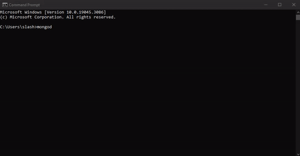
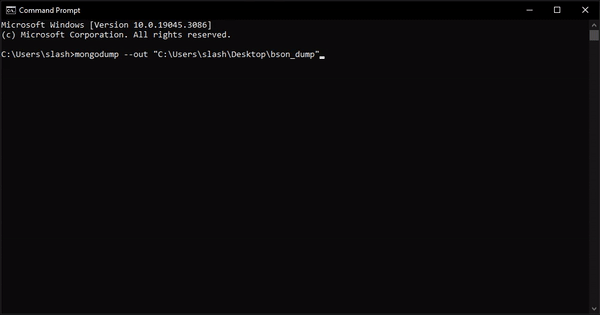

# Recovering files from a MongoDB Atlas snapshot

In order to access the customer files that were in the Atlas snapshot, I had to utilize MongoDB's Community Server, Tools package, and Shell.

Using these technologies, I was able to:
1. Locally host a database on my PC
2. Execute a WiredTiger -> BSON dump
3. Restored all customer data onto database

# 1. Locally host a database on my PC
To start, I had to move copies of the files in the Atlas snapshot into my local dbPath folder (C:\data\db).

Afterwards, I'm now permitted to run the `mongod` command, which launches a MongoDB daemon in the background

# 2. Executed a WiredTiger -> BSON dump
Now that the daemon is running, I'm able to execute `mongodump --out "C:\Users\slash\Desktop\bson_dump"`, which creates BSON backup files of the database files located in my local dbPath.

